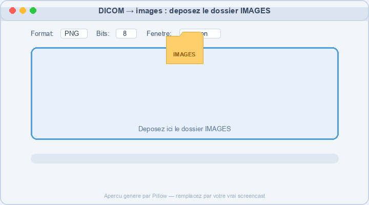

<div align="center">



<br>

<!-- DÉMO : ceci est un GIF de démonstration généré automatiquement (assets/make_demo_gif.py).
     Pour le remplacer par votre vrai screencast, écrasez simplement assets/demo.gif.
     (Voir la section « 🎬 Enregistrer la démo » en bas du README.) -->


<br>

**Vous avez un CD de scanner, une pile de fichiers `CT000000`, et vous voulez juste des images normales.**
<br>Cet outil fait exactement ça — en local, sur votre machine, sans rien envoyer nulle part.

<br>


</div>

---

## Le problème, en une phrase

Les CD de scanner crachent des fichiers DICOM aux noms bizarres (`CT000000`, `CT000001`…), **sans extension**, souvent **compressés en JPEG Lossless**, illisibles par un visualiseur photo classique. Vous, vous voulez juste des **PNG** ou des **JPEG** propres, bien rangés, dans un **ZIP** prêt à partager.

## La solution, en une phrase

Vous **déposez le dossier `IMAGES`** sur une petite fenêtre. L'outil détecte les DICOM, les regroupe par série, les convertit correctement, et vous rend un ZIP. C'est tout.

<div align="center">

```
📂 IMAGES/            ┌─────────────┐          📦 dicom_export_2026….zip
   ├─ CT000000        │             │             ├─ Study_001/
   ├─ CT000001   ───► │  scan_ext   │  ───►       │   ├─ Series_002_PARANCHYME/
   ├─ CT000002        │             │             │   │   ├─ Slice_000001.png
   └─ …               └─────────────┘             │   │   └─ metadata.json
                                                  └─ export_summary.json
```

</div>

---

## ✨ Ce qu'il fait (et fait bien)

| | |
|---|---|
| 🔎 **Détecte les DICOM sans extension** | Analyse l'en-tête de chaque fichier, jamais le nom. Un `CT000042` est reconnu. |
| 🗂️ **Regroupe par série** | `SeriesInstanceUID` → SCOUTS, PARANCHYME, MÉDIASTIN, OS, coronal, sagittal… avec un indice de type. |
| 🧭 **Trie les coupes dans le bon ordre** | Position spatiale réelle (`ImagePositionPatient` projetée sur la normale au plan), puis replis intelligents. Pas de tri par nom de fichier hasardeux. |
| 🧩 **Décode les formats compressés** | Y compris **JPEG Lossless Process 14 (`1.2.840.10008.1.2.4.70`)**, JPEG 2000, JPEG-LS, RLE. |
| 🩻 **Respecte la physique de l'image** | Applique Rescale Slope/Intercept → **unités Hounsfield** *avant* tout fenêtrage. Gère les pixels signés et MONOCHROME1/2. |
| 🎚️ **Fenêtres médicales correctes** | Poumon, médiastin, os, ou les valeurs du fichier — **la même fenêtre pour toute la série** (cohérence entre coupes). |
| 🔒 **Anonymise par défaut** | Aucun nom, ID, date de naissance ou n° d'accession dans les fichiers, les dossiers ou le ZIP. |
| 📦 **Emballe tout** | Images + `metadata.json` par série + résumé + journal d'erreurs, dans un ZIP horodaté. |

> [!NOTE]
> Ce n'est **pas** un visualiseur DICOM ni un logiciel de diagnostic. C'est un convertisseur, point. Il ne modifie **jamais** vos fichiers source.

---

## 🚀 Démarrage rapide

### 1. Installer (une seule fois)

**macOS**
```bash
python3 -m venv .venv
source .venv/bin/activate
python -m pip install --upgrade pip
pip install -r requirements.txt
# Fenêtre trop capricieuse ? Tk manquant ? :
#   brew install python-tk         (adapté à votre version de Python)
```

**Windows**
```bat
py -m venv .venv
.venv\Scripts\activate
python -m pip install --upgrade pip
pip install -r requirements.txt
```

### 2. La façon la plus simple : glisser-déposer

```bash
python dicom_drop.py
```

<div align="center">

```
        ┌────────────────────────────────────────────┐
        │                     ⬇                       │
        │                                             │
        │      Déposez ici le dossier IMAGES          │
        │        (ou cliquez pour le choisir)         │
        │                                             │
        │   Format: PNG   Bits: 8   Fenêtre: poumon   │
        └────────────────────────────────────────────┘
              ▓▓▓▓▓▓▓▓▓▓▓▓▓▓▓░░░░░  Conversion 312/480
```

</div>

Vous déposez, il analyse **toutes les séries**, convertit, et affiche le chemin du ZIP. Rien d'autre à faire.
*(Le glisser-déposer réel utilise `pip install tkinterdnd2` ; sans lui, la zone devient un bouton « Choisir ».)*

---

## 🧰 Les trois façons de l'utiliser

<table>
<tr>
<td width="33%" valign="top">

### 🖱️ Glisser-déposer
`python dicom_drop.py`

Le plus simple. Vous déposez, il fait tout, toutes les séries, ZIP compris.

</td>
<td width="33%" valign="top">

### 🪟 Interface à cocher
`python dicom_to_images_gui.py`

Vous voyez la liste des séries et **cochez** celles à exporter. Format, bits, fenêtre au choix.

</td>
<td width="33%" valign="top">

### ⌨️ Ligne de commande
`python dicom_to_images.py …`

Le contrôle total : plages d'images, une sur N, presets, anonymisation stricte, scripts.

</td>
</tr>
</table>

### Exemples en ligne de commande

D'abord, **regarder ce qu'il y a sur le CD** :
```bash
python dicom_to_images.py --input "/Volumes/SCANNER/IMAGES" --list-series
```
```
1. SCOUTS      — 2 images   — 645 × 820  — [SCOUT/LOCALIZER]
2. PARANCHYME  — 420 images — 512 × 512  — [LUNG/PARANCHYME]
3. MEDIASTIN   — 380 images — 512 × 512  — [MEDIASTINUM]
```

Puis **exporter la série pulmonaire** en PNG fenêtré poumon + ZIP :
```bash
python dicom_to_images.py \
  --input "/Volumes/SCANNER/IMAGES" \
  --series "PARANCHYME" \
  --format png --bit-depth 8 --window lung \
  --zip
```

Quelques options utiles :

| Option | À quoi ça sert |
|---|---|
| `--all-series` / `--series-index 2` | Tout exporter, ou une série précise par son numéro |
| `--start 100 --end 250` | N'exporter qu'une plage de coupes (après tri spatial) |
| `--step 5` · `--parity even` | Une image sur 5 · seulement les paires |
| `--window lung\|mediastinum\|bone\|dicom\|custom` | Fenêtre CT (`--wc` / `--ww` pour custom) |
| `--bit-depth 16` | PNG 16 bits brut (dynamique préservée) |
| `--keep-identifiers` | Garder les données patient (⚠️ avec avertissement) |

Fenêtres CT de référence : **poumon** WC −600 / WW 1500 · **médiastin** WC 40 / WW 400 · **os** WC 400 / WW 1800.

---

## 🖼️ Trois façons d'obtenir vos images

- **PNG 8 bits fenêtré** — ce que vous voulez 9 fois sur 10. Net, léger, même fenêtre sur toute la série.
- **PNG 16 bits brut** — pour garder toute la dynamique. Les paramètres de reconstruction (`min`, `max`, `scale`, `offset`) sont écrits dans `metadata.json`, sans faux-semblant.
- **JPEG** — pratique et léger, mais *avec perte*. L'outil vous le rappelle. Généré à partir de l'image fenêtrée.

> [!IMPORTANT]
> Résolution **native** conservée. Aucun redimensionnement, aucun lissage, aucune accentuation, aucun contraste automatique. Ce que le scanner a produit, c'est ce que vous obtenez.

---

## 📁 Ce que vous récupérez

```
export/
├─ Study_001/
│  ├─ Series_002_PARANCHYME/
│  │  ├─ Slice_000001.png
│  │  ├─ Slice_000002.png
│  │  └─ metadata.json          ← fenêtre utilisée, tri, mapping source→export…
│  └─ Series_003_MEDIASTIN/
│     └─ …
├─ export_summary.json          ← le bilan complet
├─ conversion_errors.txt        ← seulement s'il y a eu des soucis
└─ dicom_export_20260712_151936.zip
```

Les noms de fichiers sont **ordonnés et neutres** : jamais de donnée patient dedans.

---

## 🔐 Confidentialité — pour de vrai

- **100 % local.** Aucun appel réseau, aucun upload, aucun cloud. Vous pouvez couper le Wi-Fi.
- **Anonymisation par défaut.** Nom, ID, naissance, adresse, n° d'accession, médecin : retirés des exports.
- **Vos fichiers source ne sont jamais touchés** — ni modifiés, ni déplacés, ni supprimés.

---

## 🧊 Module 3D — reconstruction volumique & segmentation pulmonaire

Une application desktop **PySide6 + VTK**, entièrement locale, reconstruit le volume 3D
à partir des coupes originales et permet de naviguer dedans.

```bash
pip install -r requirements.txt      # installe aussi SimpleITK, vtk, PySide6, scipy, scikit-image
python app_3d.py
```

Disposition : trois vues **MPR synchronisées** (axiale / coronale / sagittale) à gauche,
**rendu volumique VTK** à droite, panneau de contrôle sur le côté.

**Ce que fait le module 3D :**

- Reconstruit un volume **fidèle à la géométrie DICOM** : `PixelSpacing`, espacement inter-coupes
  réel (calculé sur `ImagePositionPatient` projeté sur la normale), direction cosines, origine physique.
- **Détecte les anomalies** : espacement irrégulier, coupes manquantes/dupliquées, orientations
  mélangées, dimensions incompatibles — et **avertit** avant de reconstruire.
- Conversion en **unités Hounsfield** (Rescale Slope/Intercept) — jamais d'inversion IA des données.
- Presets de rendu **poumon / os / médiastin / custom** (transfer functions VTK).
- **Segmentation pulmonaire automatique non-IA** (seuillage HU + morphologie 3D + séparation
  droite/gauche), **volumes en ml**, export **STL / OBJ / PLY / VTP**.
- Capture PNG de la vue 3D, **sauvegarde de session JSON** (sans aucune donnée patient).

> [!WARNING]
> **La segmentation et la reconstruction ne constituent pas un diagnostic médical.**
> Visualisation fondée sur les données DICOM originales ; la fidélité dépend du protocole
> d'acquisition, de la résolution, du tri des coupes et de la segmentation.
> Cet outil **n'est pas un dispositif médical certifié**.

### Pas à pas

1. **Importer une série `PARANCHYME`** : *Choisir un dossier DICOM…* → sélectionner la série dans la liste
   (le type heuristique `[LUNG/PARANCHYME]`, le nombre de coupes et la géométrie s'affichent).
2. **Construire le volume** : bouton *Construire le volume 3D* (worker threadé, barre de progression,
   avertissements géométriques éventuels).
3. **Segmenter les poumons** : bouton *Segmenter les poumons* → volumes droit/gauche/total en ml.
4. **Exporter en STL** : *Exporter poumon droit (STL)…* → `Right_Lung.stl` (noms neutres, sans identité).

> Sur une machine sans GPU/OpenGL, lancez avec `DICOM3D_NO_VTK=1 python app_3d.py` : les vues MPR,
> la segmentation et les exports restent disponibles, seule la vue volumique 3D est masquée.

## 🌐 Boilerplate WebGL — Cornerstone + Three.js

Le dossier [`web/`](web/) contient un exemple navigateur autonome : Cornerstone décode une pile
DICOM locale, puis un shader Three.js la rend par ray marching dans une `Data3DTexture` WebGL2.
Le rendu inclut filtrage trilinéaire, fonctions de transfert poumon/tissus mous/os, éclairage par
gradient, ombres volumiques optionnelles, boîte de coupe à six faces et qualité progressive pendant
l'orbite. Le bouton **3D cutaway** applique une vue en coupe comme dans la démonstration, puis les
bornes minimum/maximum X/Y/Z permettent de déplacer chaque plan en direct.

```bash
cd web
npm install
npm run dev
```

Un fantôme thoracique synthétique s'affiche sans fichier médical. Le bouton **Open DICOM folder**
charge ensuite une série monochrome ; tout reste local au navigateur. Voir
[`web/README.md`](web/README.md) pour l'architecture, l'intégration dans une application Cornerstone
existante et les limites explicites du boilerplate.

## 🧪 Tests

```bash
python -m pytest
```
```
52 passed
```
Couvre la détection sans extension, le tri spatial et ses replis, le rescale Hounsfield,
la fenêtre pulmonaire, MONOCHROME1, PNG 8/16 bits, la création du ZIP, l'anonymisation,
la gestion d'un fichier corrompu, le nettoyage des noms et le mapping source→export.

---

## 🩹 En cas de pépin

<details>
<summary><b><code>ModuleNotFoundError: No module named '_tkinter'</code></b></summary>

Votre Python n'a pas Tk. Installez-le : `brew install python-tk` (macOS, adapté à votre version de Python),
ou recréez le venv avec un Python qui inclut Tk (souvent 3.11/3.12 de python.org).
</details>

<details>
<summary><b>« Impossible de décoder cette série : JPEG Lossless Process 14… »</b></summary>

Il manque un décodeur. Installez `pylibjpeg-libjpeg` (déjà dans `requirements.txt`),
ou en dernier recours **GDCM** : `conda install -c conda-forge gdcm`.
</details>

<details>
<summary><b>Le glisser-déposer ne réagit pas</b></summary>

Installez `pip install tkinterdnd2`. Sans lui, la zone de dépôt fonctionne quand même
en **cliquant** dessus pour choisir un dossier.
</details>

---

## 🎬 Enregistrer la démo

Le GIF en haut est une **démo générée automatiquement** (`python assets/make_demo_gif.py`, ne dépend que de Pillow). Vous pouvez la garder telle quelle, ou la remplacer par un vrai screencast :

1. **Lancez l'outil** : `python dicom_drop.py`
2. **Enregistrez l'écran** :
   - macOS : `⌘⇧5` → *Enregistrer une partie de l'écran* → capturez la fenêtre pendant que vous déposez un dossier `IMAGES`. Vous obtenez un `.mov`.
   - Windows : `Win+G` (Xbox Game Bar) ou tout enregistreur d'écran.
3. **Convertissez en GIF** (facultatif mais recommandé, plus léger et joue en boucle) :
   ```bash
   # nécessite ffmpeg : brew install ffmpeg
   ffmpeg -i demo.mov -vf "fps=12,scale=720:-1:flags=lanczos" -loop 0 assets/demo.gif
   ```
4. **Branchez-le** : dans le README, remplacez `assets/demo-placeholder.svg` par `assets/demo.gif`. C'est tout.

> Astuce : gardez le GIF sous ~5 Mo et ~720 px de large pour un affichage fluide sur GitHub.

## 🗂️ Structure du projet

À la racine, uniquement les **points d'entrée** (scripts qui lancent une application) ;
tout le reste vit dans le package `dicomkit/`.

**Points d'entrée (racine)**

| Fichier | Rôle |
|---|---|
| `dicom_drop.py` | Interface glisser-déposer (fait tout automatiquement) |
| `dicom_to_images_gui.py` | Interface avec sélection des séries |
| `dicom_to_images.py` | CLI complète |
| `app_3d.py` | Application desktop 3D (PySide6 + VTK) |
| `vtk_view.py` | Visualiseur 3D VTK autonome |

**Package `dicomkit/`**

| Module | Rôle |
|---|---|
| `dicomio/dicom_core.py` | Détection, décodage, rescale, fenêtrage |
| `dicomio/dicom_series.py` | Regroupement + tri spatial + classification |
| `export/image_export.py` | PNG 8/16 bits, JPEG |
| `export/metadata_export.py` · `export/archive.py` | Métadonnées, archive ZIP |
| `volume/` | Reconstruction volumique, segmentation, maillages |
| `viewer/` | Fenêtre Qt, vues MPR, rendu VTK, workers |
| `anonymization.py` · `utils.py` | Anonymisation, utilitaires partagés |
| `tests/` | Suite pytest |

<div align="center">
<br>
<sub>Fait pour rendre service — local, sobre, sans surprise. 🩻</sub>
</div>
